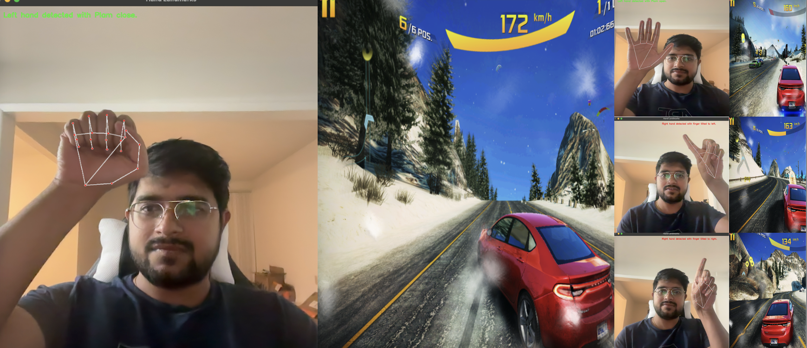

# 🎮 Gesture Recognition for Game Control

This project demonstrates the use of hand-based gesture controls to interact with a racing game (`Asphalt 8`). Using **MediaPipe** for real-time hand landmark detection and **OpenCV** for video capture, the system maps specific hand gestures to game controls such as steering, acceleration, braking, and nitro boost.

---

## 🎉 Features
- **Real-Time Hand Tracking**: Uses MediaPipe to detect hand landmarks in real-time.
- **Gesture-Based Controls**:
  - Open Left palm: Activates nitro boost.
  - Closed Left palm: Activates braking.
  - Tilted Right index finger: Controls steering (left or right).
- **Platform Compatibility**: Works with any system supporting Python, OpenCV, and MediaPipe.
- **Dynamic Background Handling**: Tested under various lighting and background conditions.

---

## 📂 Project Directory Structure

Here is an organized overview of the project files:

```plaintext
Gesture-Recognition/
├── 📜 play.py               🚀 Main entry point of the application
├── 📜 controller.py         🎮 Handles game control mappings for gestures
├── 📜 capture_video.py      📹 Manages video capture and frame processing
├── 📜 hand_landmark.py      ✋ Handles hand landmark detection using MediaPipe
├── 📜 controller_enum.py    🕹️ Defines key mappings for steering and acceleration
├── 📜 requirements.txt      📦 Lists all dependencies required for the project
```


## 💻 Prerequisites
- Python 3.7 or later
- Dependencies:
  - `mediapipe`
  - `opencv-python`
  - `pynput`

Install all dependencies using:
```bash
pip install -r requirements.txt
```

## 🛠️ How to run
- **Open Asphalt8**
- **Update contols to**:
    - Enable Auto Acceleration
    - a: turn left
    - d: turn right
    - w: nitro boost
    - s: brake
- **Launch applicaiton using play.py**:
```bash
cd cv_project
python play.py
```
## 📸 Live Demo
[](https://youtu.be/jf9etWVmbEA?si=i6ByldbLPhPqaSQD)